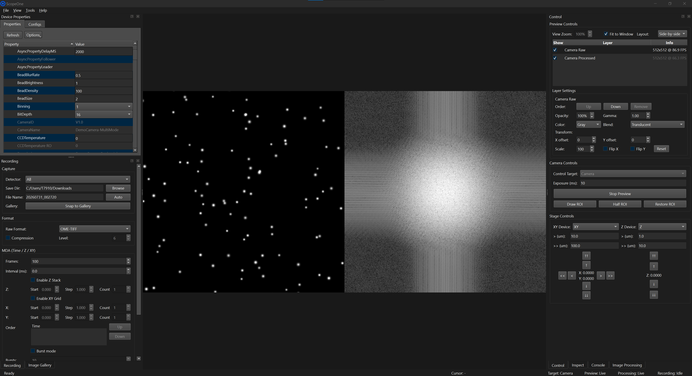

<p align="center">
  
</p>

<p align="center">
  <a href="https://github.com/Experimental-Microscopy-Lab/ScopeOne/actions/workflows/compile-check.yml"></a>
  <!-- <a href="https://doi.org/10.48550/arXiv.2606.19384"></a> -->
</p>

ScopeOne is an open-source microscopy control software for multi-camera imaging, originally developed for in-house lab use. Built with C++ and Qt, it uses a native [MMCore](https://github.com/micro-manager/mmCoreAndDevices) backend for single-camera operation and one isolated camera agent per device for simultaneous multi-camera preview and acquisition.
It retains full compatibility with the [Micro-Manager](https://micro-manager.org/) device ecosystem and adds a modular real-time image processing pipeline with support for background calibration, temporal filtering, FFT analysis, and more.

<p align="center">
  <br>
  <sub> Graphical User Interface of ScopeOne</sub>
</p>

As an open-source project, ScopeOne builds on existing community efforts to reduce duplicated work and provides an alternative that enriches the microscopy community. While the current development is conducted in close collaboration with the optics and biology teams within our laboratory, we aim to expand engagement with the broader research community to make the platform more practical, accessible, and universal. Any issues or pull requests are greatly appreciated！

## 🚀 Quick Start

### For Users

Download the latest release installer from the [Releases](https://github.com/Experimental-Microscopy-Lab/ScopeOne/releases) page.

**System Requirements:**

- Windows 10/11 (64-bit)
- Micro-Manager device adapters for your hardware

**Device Adapter Setup:**

ScopeOne loads Micro-Manager configuration files (.cfg) directly and includes the basic adapters required for its demo configurations. To access additional hardware adapters, install [Micro-Manager 2.0](https://download.micro-manager.org/nightly/2.0/Windows/). ScopeOne automatically detects the standard `C:\Program Files\Micro-Manager-2.0` installation. If you installed Micro-Manager in a different location, select `Tools → Settings...` in ScopeOne, then set `Micro-Manager Directory` to the folder containing the Micro-Manager device adapter files, typically named `mmgr_dal_*.dll`. Bundled adapters take precedence over external adapters. We recommend confirming that hardware works in the selected Micro-Manager installation before using it in ScopeOne.

**Dual-camera Setup:**

There is an example dual-camera .cfg file in the config folder, just change the camera labels in Devices section to match your camera models.

### For Developers

**Prerequisites:**

- [CMake](https://cmake.org/download/) 4.1.0
- [Visual Studio 2022](https://visualstudio.microsoft.com/vs/) (MSVC v143 toolset)
- [Qt](https://www.qt.io/development/download-qt-installer-oss) 6.9.1 (msvc2022_64)
- OpenCV 4.12.0
- mmCoreAndDevices

Clone ScopeOne and initialize all submodules with:

```powershell
git clone --recurse-submodules https://github.com/Experimental-Microscopy-Lab/ScopeOne.git
```

For an existing checkout, initialize the submodules with:

```powershell
git submodule update --init --recursive
```

The expected layout is:

```text
ScopeOne/
  ScopeOneCore/
    external/
      mmCoreAndDevices/
      opencv-4.12.0/
      ScopeWriter/
```

ScopeWriter contains its filesystem Zarr V3 writer and carries libtiff, zlib, zstd and crc32c under its own `third_party` directory. It builds these dependencies from source without downloading packages during CMake configuration.

**Windows Build Steps:**

1. Build and install `ScopeOneCore`:

```powershell
cmake -S ScopeOneCore -B ScopeOneCore/build
cmake --build ScopeOneCore/build --config Release --parallel
cmake --install ScopeOneCore/build --config Release
```

2. Build the GUI application:

```powershell
cmake -S . -B build
cmake --build build --config Release --parallel
```

3. Run:

```powershell
.\build\Release\ScopeOne.exe
```

**Linux and macOS Build Steps (experimental):**

Linux and macOS use the same native build flow. Use the top-level `micro-manager` repository to configure the native build, then compile `MMDevice`, `MMCore`, and the required device adapters. Create a symlink so ScopeOne can find the `mmCoreAndDevices` tree at the path expected by the current CMake files.

Run `./scripts/build-unix.sh` from the ScopeOne repository root on Linux or macOS to automate the complete sequence below.

1. Install common build dependencies.

Linux:

```bash
sudo apt install \
  git subversion build-essential cmake autoconf automake libtool autoconf-archive \
  pkg-config libboost-all-dev qt6-base-dev libopencv-dev libtiff-dev zlib1g-dev
```

macOS:

```bash
xcode-select --install
brew install \
  git subversion cmake autoconf automake libtool autoconf-archive \
  pkg-config boost qt opencv libtiff zlib
```

2. Clone Micro-Manager and create the `mmCoreAndDevices` symlink:

```bash
cd /path/to/ScopeOne/ScopeOneCore
mkdir -p external
cd external

git clone --recurse-submodules https://github.com/micro-manager/micro-manager.git micro-manager
ln -s micro-manager/mmCoreAndDevices mmCoreAndDevices

cd micro-manager
git submodule update --init --recursive
```

3. Configure Micro-Manager without the Java application layer:

```bash
./autogen.sh
./configure --without-java --enable-static
```

4. Build the native core components:

```bash
# Adjust `-j4` to match your CPU cores
make -C mmCoreAndDevices/MMDevice -j4
make -C mmCoreAndDevices/MMCore -j4
```

5. Build the adapters required by the demo configuration. You can build additional adapters as needed.

```bash
make -C mmCoreAndDevices/DeviceAdapters/DemoCamera -j4
make -C mmCoreAndDevices/DeviceAdapters/Utilities -j4
```

6. Build and install `ScopeOneCore`:

```bash
cd /path/to/ScopeOne
cmake -S ScopeOneCore -B ScopeOneCore/build -DCMAKE_BUILD_TYPE=Release
cmake --build ScopeOneCore/build --parallel
cmake --install ScopeOneCore/build
```

7. Build the GUI application:

```bash
cmake -S . -B build -DCMAKE_BUILD_TYPE=Release
cmake --build build --parallel
```

The Linux or macOS executable is expected at:

```text
build/ScopeOne
```

To run `config/MMConfig_demo.cfg`, copy its runtime adapters next to the ScopeOne executable.

Linux:

```bash
cp -L \
  ScopeOneCore/external/mmCoreAndDevices/DeviceAdapters/DemoCamera/.libs/libmmgr_dal_DemoCamera.so.0 \
  ScopeOneCore/external/mmCoreAndDevices/DeviceAdapters/Utilities/.libs/libmmgr_dal_Utilities.so.0 \
  build/
```

macOS uses an extensionless Mach-O bundle rather than the static `.a` file:

```bash
cp \
  ScopeOneCore/external/mmCoreAndDevices/DeviceAdapters/DemoCamera/.libs/libmmgr_dal_DemoCamera \
  ScopeOneCore/external/mmCoreAndDevices/DeviceAdapters/Utilities/.libs/libmmgr_dal_Utilities \
  build/
```

## 🤖 Automation and AI Agents

The desktop app exposes a language-neutral local control API and shared-memory frame channel. An AI agent does not run inside ScopeOne or depend on Python. A tool adapter can discover supported operation groups with the `capabilities` request, read a structured observation with `state_snapshot`, and invoke the exposed camera, stage, mosaic, processing, image analysis, experiment, recording, layer, and markup operations. Requests may carry an ID that is echoed by the app for correlation. Recording save operations use `ome-tiff` by default and also accept `ome-zarr`, `tiff` and `binary`.

The API reports which operations mutate hardware, write files, remove state, or may run for a long time. An agent adapter should request user confirmation before those operations and verify the result with the returned read-back value, experiment status, or a new state snapshot. The Python package is one optional client implementation. See the [Python client and Local API protocol guide](ScopeOneCore/python/scopeone/README.md) for protocol details and runnable examples.

### MCP adapter

`ScopeOneMcpServer` is a standalone C++ MCP server included with ScopeOne. It uses MCP protocol version `2025-06-18` over standard input and output and forwards validated tool calls to the running desktop app through the Local API. It does not embed a model, open a network port, or depend on Python.

#### Claude Code plugin

Install ScopeOne first, then run these commands inside Claude Code:

```text
/plugin marketplace add Experimental-Microscopy-Lab/ScopeOne-Skill
/plugin install scopeone@scopeone
/reload-plugins
```

When prompted, select `ScopeOneMcpServer.exe` from the same directory as `ScopeOne.exe`. Start ScopeOne before asking Claude to inspect or control it. The plugin supplies the MCP configuration and agent operating guidance, so no Python installation or manual MCP server launch is required.

#### Other MCP hosts

To use it:

1. Start ScopeOne. Load the device configuration manually or ask the agent to load it after confirmation.
2. Configure an MCP-compatible agent host to launch `ScopeOneMcpServer.exe` from the ScopeOne installation or portable package directory using the `stdio` transport.
3. Ask the agent to inspect ScopeOne state before requesting an action.
4. Review hardware or destructive tool calls before allowing the adapter's required `confirm=true` argument.

Use `scopeone` as the server name, `stdio` as the transport, the absolute path to `ScopeOneMcpServer.exe` as the command, and no command-line arguments. The exact configuration syntax depends on the agent host.

The MCP tool set mirrors the Local API operation catalog, including system state, configuration, preview layers, automatic display levels, source alignment, markups, device properties, exposure, ROI, stages, stage mosaics, processing, experiments, recording sessions, frame transfer, and analysis. Agents can read the current frame of any image layer, monitor live acquisition and writer progress, and optionally export or display particle masks. ScopeOne remains the authority for parameter validation and hardware read-back, and MCP tool calls are visible in the desktop UI through the same application state used by manual controls.

## 🔬 Tested Devices

- Yokogawa CSU X1
- Hamamatsu C13440
- Andor 897D

The current validation list is still short, but the codebase has been cleaned to remove early hard-coded device assumptions. In principle, ScopeOne should follow Micro-Manager device compatibility.

## 🖥️ Tested System Configurations

- Windows 10 Version 21H2, Dual Intel(R) Xeon(R) E5-2637 v3, 64 GB RAM, NVIDIA Quadro K620
- Windows 11 Version 25H2, Intel(R) Core(TM) Ultra 5 125U, 64 GB RAM
- Fedora Linux 44 (Workstation Edition), Intel(R) Core(TM) i7-7700, 32 GB RAM
- macOS 26.5.2, Apple M1 Pro, 16 GB RAM

We build and test ScopeOne on the above machines, which are comparatively older and weaker than many typical optical lab computers. However, ScopeOne still provides smooth real-time preview and processing on them.
