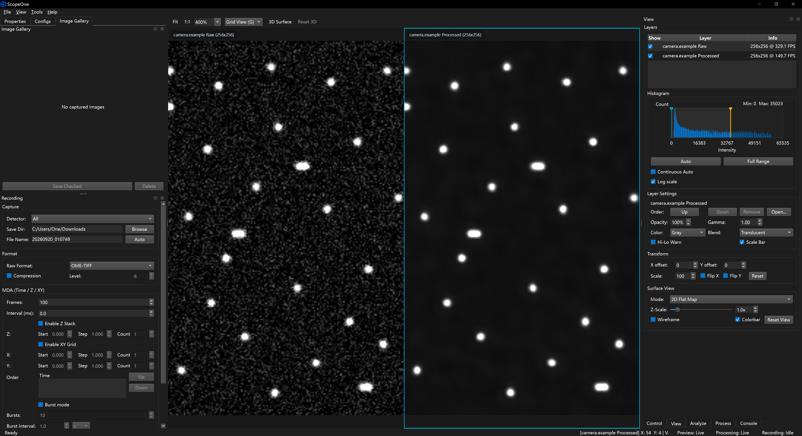

<p align="center">
  
</p>

<p align="center">
  <a href="https://github.com/Experimental-Microscopy-Lab/ScopeOne/actions/workflows/compile-check.yml"></a>
  <a href="LICENSE"></a>
  <!-- <a href="https://doi.org/10.48550/arXiv.2606.19384"></a> -->
</p>

ScopeOne is a high-performance open-source microscopy control platform built with C++ and Qt. It is designed to be an extensible platform for advanced microscopy applications, including multiple camera live imaging, on-the-fly image processing, and automated experiments.
 It retains compatibility with the [Micro-Manager](https://micro-manager.org/) broad device ecosystem while allowing featuers like online image processing with GPU acceleration, deep learning inference and more.
<p align="center">
  <br>
  <sub> Graphical User Interface of ScopeOne</sub>
</p>

As an open-source project, ScopeOne builds on existing community efforts to reduce duplicated work and provides an alternative that enriches the microscopy community. While the current development is conducted in close collaboration with the optics and biology teams within our laboratory, we aim to expand engagement with the broader research community to make the platform more practical, accessible, and universal. Any issues or pull requests are greatly appreciated！

## ✨ New Features

### Deep Learning Inference

Deep learning is becoming an increasingly powerful tool for microscopy image restoration and analysis. ScopeOne allows users to import pre-trained AI models through the widely supported ONNX model format and apply them directly to live camera streams or recorded images. Models can run on either the CPU or GPU.

<p align="center">
  <br>
  <sub>Real-time denoising demo using <a href="https://huggingface.co/qualcomm/DnCNN">DnCNN</a> at approximately 150 FPS for 256 × 256 images, tested on an NVIDIA RTX 4070 Ti</sub>
</p>

### GPU-Accelerated Online Image Processing
Despite the deep learning, traditional image processing methods remain essential. GPU-accelerated image processing pipeline can be applied to live camera streams or recorded images, including filtering, background subtraction, FFT, and more. Users can customize image processing algorithms and parameters to suit their specific needs via the ScopeOne plugin system.
## 🚀 Quick Start

### For Users

Download the latest release installer from the [Releases](https://github.com/Experimental-Microscopy-Lab/ScopeOne/releases) page.

**System Requirements:**

- Windows 10/11 (64-bit)
- Micro-Manager device adapters for your hardware

**Device Adapter Setup:**

ScopeOne loads Micro-Manager configuration files (.cfg) directly and includes the basic adapters required for its demo configurations. To access additional hardware adapters, install [Micro-Manager 2.0](https://download.micro-manager.org/nightly/2.0/Windows/). ScopeOne automatically detects the standard `C:\Program Files\Micro-Manager-2.0` installation. If you installed Micro-Manager in a different location, select `Tools → Settings...` in ScopeOne, then set `Micro-Manager Directory` to the folder containing the Micro-Manager device adapter files, typically named `mmgr_dal_*.dll`. Bundled adapters take precedence over external adapters. We recommend confirming that hardware works in the selected Micro-Manager installation before using it in ScopeOne.

**Dual-camera Setup:**

There is an example dual-camera .cfg file in the config folder, just change the camera labels in Devices section to match your camera models.

### For Developers

**Prerequisites:**

- [CMake](https://cmake.org/download/) 4.1.0
- [Visual Studio 2022](https://visualstudio.microsoft.com/vs/) (MSVC v143 toolset)
- [vcpkg](https://github.com/microsoft/vcpkg) for Qt 6.11.2 and OpenCV 4.14.0
- mmCoreAndDevices

Clone ScopeOne and initialize all submodules with:

```powershell
git clone --recurse-submodules https://github.com/Experimental-Microscopy-Lab/ScopeOne.git
```

For an existing checkout, initialize the submodules with:

```powershell
git submodule update --init --recursive
```

The expected layout is:

```text
ScopeOne/
  ScopeOneCore/
    include/scopeone/      Core API and external plugin contracts
    external/
      mmCoreAndDevices/
      ScopeWriter/
```

ScopeWriter contains its filesystem Zarr V3 writer. It uses libtiff, zlib, zstd and crc32c from vcpkg; ScopeOne lists them in its root `vcpkg.json`, and ScopeWriter declares the same dependencies in its own `vcpkg.json` for standalone builds.

### Plugin layout

ScopeOne loads external plugins from these directories beside the application:

- `plugins/processing` adds processing modules to the shared pipeline
- `plugins/tools` adds optional workflow windows to the Tools menu
- `plugins/hardware` adds isolated hardware providers hosted by `ScopeOne_DriverHost`
- `plugins/hardware` also contains DAQ devices and signal source plugins

All plugins use the installed `scopeone::PluginSDK` CMake target and the public contracts in `ScopeOneCore/include/scopeone`. The Core package owns the stable plugin-facing headers for image frames, hardware providers, DAQ devices, signal sources, processing modules, tool plugins, shared frames and manifests. A common manifest contains `id`, `name`, `version`, `scopeOneApi`, and `kind`. **Tools > Plugin Manager** installs plugins into the current user's application data directory. Hardware plugins can also be enabled and configured there; changes take effect after restart. Reference plugins are organized under `plugins/hardware`, `plugins/processing`, and `plugins/tools`.

Micro-Manager remains the built-in camera provider and continues to load its Device Adapters from `.cfg` files. Native camera devices that do not belong in Micro-Manager use the `HardwareProvider` plugin contract. DAQ and signal acquisition are separate plugin contracts and are not linked into `ScopeOne.exe`.

The Image Processing panel can process all live cameras or one selected camera. Recorded images and stacks open in independent windows, and the active image viewer becomes the target for Layers, Inspect, Image Processing, and Save As. Processing the current image or complete stack runs in the background and opens the result in a new window; stack results also remain available in Gallery. Temporal module state is preserved across each stack without changing live pipeline state.

**Windows Build Steps:**

Set up vcpkg once outside the ScopeOne repository:

```powershell
git clone https://github.com/microsoft/vcpkg.git C:/dev/vcpkg
C:/dev/vcpkg/bootstrap-vcpkg.bat
$env:VCPKG_ROOT = "C:/dev/vcpkg"
```

For an existing vcpkg checkout, run `git -C $env:VCPKG_ROOT pull --ff-only` and rerun its `bootstrap-vcpkg.bat` before migrating.

Build Core, plugins, and GUI with the repository script:

```powershell
.\scripts\build.ps1 --configure
```

When migrating an existing build, use `--clean --configure` once to replace the old CMake caches. Later builds only need `.\scripts\build.ps1`.

The root `vcpkg.json` pins Qt and OpenCV and provides ScopeWriter's libtiff, zlib, zstd and crc32c. Core, GUI, and plugins share `vcpkg_installed/`; the build scripts select `x64-windows`, `x64-linux-dynamic`, `arm64-osx-dynamic`, or another supported host triplet. Linux and macOS use the dynamic triplets so Qt is shared between the GUI, ScopeOneCore, and plugins. CMake installs dependencies on the first configure, and the Windows GUI uses vcpkg's `windeployqt` to deploy Qt plugins. Micro-Manager, CUDA, and ONNX Runtime retain their existing dependency setup.

For a direct Core CMake configure:

```powershell
cmake -S ScopeOneCore -B ScopeOneCore/build `
  "-DCMAKE_TOOLCHAIN_FILE=$env:VCPKG_ROOT/scripts/buildsystems/vcpkg.cmake" `
  "-DVCPKG_MANIFEST_DIR=$PWD" `
  "-DVCPKG_INSTALLED_DIR=$PWD/vcpkg_installed" `
  -DVCPKG_TARGET_TRIPLET=x64-windows
```

Run the built application:

```powershell
.\build\Release\ScopeOne.exe
```

**Linux and macOS Build Steps (experimental):**

Linux and macOS use vcpkg for Qt and OpenCV. Install and bootstrap vcpkg, set `VCPKG_ROOT`, then use the build script. The script selects the triplet from the host operating system and architecture. Micro-Manager is still built from its checkout because its native core and device adapters are not vcpkg dependencies.

Run `./scripts/build-unix.sh` from the ScopeOne repository root on Linux or macOS. Add `--clean` once when migrating an existing system-package build.

1. Install common build dependencies and vcpkg.

Linux:

```bash
sudo apt install \
  git subversion build-essential cmake autoconf automake libtool autoconf-archive \
  pkg-config ninja-build curl zip unzip libboost-all-dev
sudo apt install --no-upgrade \
  libgl-dev libegl-dev libopengl-dev libx11-dev libx11-xcb-dev libxrender-dev \
  libxcb1-dev libxcb-cursor-dev libxcb-icccm4-dev libxcb-util-dev libxcb-image0-dev \
  libxcb-keysyms1-dev libxcb-randr0-dev libxcb-render-util0-dev libxcb-shape0-dev \
  libxcb-shm0-dev libxcb-sync-dev libxcb-xfixes0-dev libxcb-xkb-dev libxcb-xinput-dev \
  libxcb-glx0-dev libxkbcommon-dev libxkbcommon-x11-dev
```

The second command installs the X11 and OpenGL development files that vcpkg's `qtbase` port expects from the system. It uses the glvnd `libgl-dev`/`libegl-dev` packages instead of `libgl1-mesa-dev`/`libegl1-mesa-dev`, so `--no-upgrade` can install it without upgrading the installed Mesa drivers.

macOS:

```bash
xcode-select --install
brew install \
  git subversion cmake autoconf automake libtool autoconf-archive \
  pkg-config ninja boost
```

```bash
git clone https://github.com/microsoft/vcpkg.git "$HOME/vcpkg"
"$HOME/vcpkg/bootstrap-vcpkg.sh"
export VCPKG_ROOT="$HOME/vcpkg"
```

For an existing build made with system Qt or OpenCV, pass `--clean` once to remove its CMake caches. Linux still needs system X11 and OpenGL development headers for Qt's desktop platform integration; these are not a system Qt installation.

2. Clone Micro-Manager and create the `mmCoreAndDevices` symlink:

```bash
cd /path/to/ScopeOne/ScopeOneCore
mkdir -p external
cd external

git clone --recurse-submodules https://github.com/micro-manager/micro-manager.git micro-manager
ln -s micro-manager/mmCoreAndDevices mmCoreAndDevices

cd micro-manager
git submodule update --init --recursive
```

3. Configure Micro-Manager without the Java application layer:

```bash
./autogen.sh
./configure --without-java --enable-static
```

4. Build the native core components:

```bash
# Adjust `-j4` to match your CPU cores
make -C mmCoreAndDevices/MMDevice -j4
make -C mmCoreAndDevices/MMCore -j4
```

5. Build the adapters required by the demo configuration. You can build additional adapters as needed.

```bash
make -C mmCoreAndDevices/DeviceAdapters/DemoCamera -j4
make -C mmCoreAndDevices/DeviceAdapters/Utilities -j4
```

6. Build and install `ScopeOneCore` and the GUI:

```bash
cd /path/to/ScopeOne
./scripts/build-unix.sh
```

The Linux or macOS executable is expected at:

```text
build/ScopeOne
```

To run `config/MMConfig_demo.cfg`, copy its runtime adapters next to the ScopeOne executable.

Linux:

```bash
cp -L \
  ScopeOneCore/external/mmCoreAndDevices/DeviceAdapters/DemoCamera/.libs/libmmgr_dal_DemoCamera.so.0 \
  ScopeOneCore/external/mmCoreAndDevices/DeviceAdapters/Utilities/.libs/libmmgr_dal_Utilities.so.0 \
  build/
```

macOS uses an extensionless Mach-O bundle rather than the static `.a` file:

```bash
cp \
  ScopeOneCore/external/mmCoreAndDevices/DeviceAdapters/DemoCamera/.libs/libmmgr_dal_DemoCamera \
  ScopeOneCore/external/mmCoreAndDevices/DeviceAdapters/Utilities/.libs/libmmgr_dal_Utilities \
  build/
```

## 🤖 Automation and AI Agents

The desktop app exposes a language-neutral local control API and shared-memory frame channel. An AI agent does not run inside ScopeOne or depend on Python. A tool adapter can discover supported operation groups with the `capabilities` request, read a structured observation with `state_snapshot`, and invoke the exposed camera, stage, mosaic, processing, image analysis, experiment, recording, layer, and markup operations. Requests may carry an ID that is echoed by the app for correlation. Recording save operations use `ome-tiff` by default and also accept `ome-zarr`, `tiff` and `binary`.

The API reports which operations mutate hardware, write files, remove state, or may run for a long time. An agent adapter should request user confirmation before those operations and verify the result with the returned read-back value, experiment status, or a new state snapshot. The Python package is one optional client implementation. See the [Python client and Local API protocol guide](ScopeOneCore/python/scopeone/README.md) for protocol details and runnable examples.

### MCP adapter

`ScopeOneMcpServer` is a standalone C++ MCP server included with ScopeOne. It uses MCP protocol version `2025-06-18` over standard input and output and forwards validated tool calls to the running desktop app through the Local API. It does not embed a model, open a network port, or depend on Python.

#### Claude Code plugin

Install ScopeOne first, then run these commands inside Claude Code:

```text
/plugin marketplace add Experimental-Microscopy-Lab/ScopeOne-Skill
/plugin install scopeone@scopeone
/reload-plugins
```

When prompted, select `ScopeOneMcpServer.exe` from the same directory as `ScopeOne.exe`. Start ScopeOne before asking Claude to inspect or control it. The plugin supplies the MCP configuration and agent operating guidance, so no Python installation or manual MCP server launch is required.

#### Other MCP hosts

To use it:

1. Start ScopeOne. Load the device configuration manually or ask the agent to load it after confirmation.
2. Configure an MCP-compatible agent host to launch `ScopeOneMcpServer.exe` from the ScopeOne installation or portable package directory using the `stdio` transport.
3. Ask the agent to inspect ScopeOne state before requesting an action.
4. Review hardware or destructive tool calls before allowing the adapter's required `confirm=true` argument.

Use `scopeone` as the server name, `stdio` as the transport, the absolute path to `ScopeOneMcpServer.exe` as the command, and no command-line arguments. The exact configuration syntax depends on the agent host.

The MCP tool set mirrors the Local API operation catalog, including system state, configuration, preview layers, independent image windows, automatic display levels, source alignment, markups, device properties, exposure, ROI, stages, stage mosaics, processing, experiments, recording sessions, frame transfer, and analysis. Agents can list, open, activate, process, save, and close independent image windows, read the current frame of any image layer, monitor live acquisition and writer progress, and optionally export or display particle masks. ScopeOne remains the authority for parameter validation and hardware read-back, and MCP tool calls are visible in the desktop UI through the same application state used by manual controls.

Configuration loading and unloading report an explicit lifecycle state through the Local API and MCP. A configuration with non-camera initialization warnings is reported as `partially_loaded` with failed device labels; camera backend startup failures are cleaned up and reported as errors. During `loading` or `unloading`, hardware mutations are rejected until the operation finishes.

## 🔬 Tested Devices

- Yokogawa CSU X1
- Hamamatsu C13440
- Andor 897D

The current validation list is still short, but the codebase has been cleaned to remove early hard-coded device assumptions. In principle, ScopeOne should follow Micro-Manager device compatibility.

## 🖥️ Tested System Configurations

- Windows 10 Version 21H2, Dual Intel(R) Xeon(R) E5-2637 v3, 64 GB RAM, NVIDIA Quadro K620
- Windows 11 Version 25H2, Intel(R) Core(TM) Ultra 5 125U, 64 GB RAM
- Fedora Linux 44 (Workstation Edition), Intel(R) Core(TM) i7-7700, 32 GB RAM
- macOS 26.5.2, Apple M1 Pro, 16 GB RAM

We build and test ScopeOne on the above machines, which are comparatively older and weaker than many typical optical lab computers. However, ScopeOne still provides smooth real-time preview and processing on them.
